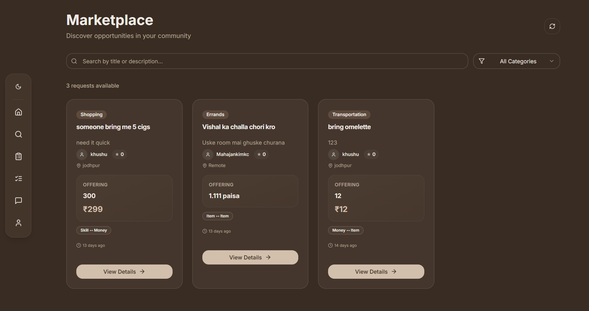

# ViniMay - Skill & Item Exchange Marketplace

A modern React-based marketplace application that enables users to exchange skills, items, and services with others in their community. Built with React, TypeScript, Supabase, and modern UI components.

## 🚀 Features

### Authentication & Onboarding
Start your journey with a beautiful, modern authentication system that supports both light and dark themes.

<div align="center">
  
  
</div>

- **Secure Authentication**: Email-based signup and login with Supabase Auth
- **Profile Setup**: Complete onboarding process to set up your profile
- **Theme Support**: Automatic dark/light mode detection with smooth transitions

### Dashboard & User Experience
The main dashboard provides a comprehensive overview of your activity and marketplace status.

<div align="center">
  
  
</div>

- **Personalized Dashboard**: View your reputation score, completion rate, and recent activity
- **Quick Actions**: Easy access to create requests, view marketplace, manage deals, and messages
- **Real-time Updates**: Live notifications for new requests and deal updates
- **Performance Metrics**: Track your success rate and completed deals

### Marketplace & Request Management
Browse and create exchange requests with powerful filtering and search capabilities.

<div align="center">
  
  
</div>

- **Request Creation**: Post detailed requests for skills, items, or services you need
- **Marketplace Browsing**: Search and filter through available requests by category
- **Advanced Filtering**: Find exactly what you're looking for with smart search
- **Request Details**: Comprehensive request forms with prerequisites, deadlines, and image uploads

### Exchange Types
- **Skill ↔ Skill**: Exchange one skill for another
- **Skill ↔ Item**: Trade skills for physical items
- **Skill ↔ Money**: Offer skills for payment
- **Item ↔ Skill**: Trade items for skills
- **Item ↔ Item**: Direct item exchanges
- **Item ↔ Money**: Sell items for money
- **Money ↔ Skill**: Pay for skills
- **Money ↔ Item**: Buy items

### Communication & Profile Management
Stay connected with other users through an integrated messaging system and manage your profile effectively.

<div align="center">
  
  
</div>

- **Messaging System**: Communicate with other users about deals
- **Profile Management**: Build and maintain your reputation
- **User Profiles**: View other users' profiles and reputation scores
- **Real-time Chat**: Instant messaging for deal discussions

### Advanced Features
- **Prerequisites System**: Set conditions that must be met before work begins
- **Reputation Scoring**: Build trust through successful deals
- **Badge System**: Earn recognition for different achievements
- **Image Uploads**: Attach images to requests for better clarity
- **Location Support**: Specify pickup/dropoff locations
- **Deadline Management**: Set and track request deadlines
- **Deal Verification**: Mutual verification system for deal completion
- **Rating System**: Rate and review completed deals

## 🛠️ Tech Stack

### Frontend
- **React 18** with TypeScript
- **Vite** for build tooling
- **React Router** for navigation
- **TanStack Query** for data fetching
- **Tailwind CSS** for styling
- **Radix UI** components with shadcn/ui
- **Lucide React** for icons
- **React Hook Form** with Zod validation
- **Sonner** for toast notifications

### Backend & Database
- **Supabase** for backend-as-a-service
- **PostgreSQL** database with Row Level Security
- **Real-time subscriptions** for live updates
- **File storage** for images
- **Authentication** with Supabase Auth

### Development Tools
- **ESLint** for code linting
- **TypeScript** for type safety
- **PostCSS** for CSS processing
- **Autoprefixer** for CSS compatibility

## 📁 Project Structure

```
src/
├── components/           # Reusable UI components
│   ├── ui/              # shadcn/ui components
│   ├── Layout.tsx        # Main layout wrapper
│   ├── RequestCard.tsx   # Request display component
│   └── ...
├── pages/               # Application pages
│   ├── Index.tsx        # Homepage with dashboard
│   ├── Marketplace.tsx  # Browse all requests
│   ├── CreateRequest.tsx # Post new requests
│   ├── ActiveDeals.tsx  # Manage active deals
│   ├── Auth.tsx         # Authentication
│   └── ...
├── hooks/               # Custom React hooks
├── integrations/        # External service integrations
│   └── supabase/        # Supabase client and types
└── lib/                 # Utility functions
```

## 🗄️ Database Schema

### Core Tables
- **profiles**: User profiles with reputation scores
- **requests**: Exchange requests posted by users
- **deals**: Active exchanges between users
- **reviews**: Ratings and feedback for completed deals
- **disputes**: Conflict resolution system
- **user_badges**: Achievement system
- **user_roles**: Role-based access control

### Key Features
- **Row Level Security (RLS)** for data protection
- **Real-time subscriptions** for live updates
- **Automatic triggers** for data consistency
- **Enum types** for data validation

## 🚀 Getting Started

### Quick Start (Ready to Use)
The application is pre-configured with a live database and ready to run:

```bash
git clone https://github.com/nafees178/HackathonBootup.git
cd HackathonBootup
npm install
npm run dev
```

### Prerequisites
- Node.js 18+ 
- npm or yarn
- (Optional) Supabase account for custom setup

### Installation

1. **Clone the repository**
   ```bash
   git clone https://github.com/nafees178/HackathonBootup.git
   cd HackathonBootup
   ```

2. **Install dependencies**
   ```bash
   npm install
   ```

3. **Environment Configuration**
   The project is currently configured with a live Supabase instance:

   **To use your own Supabase instance:**
   - Create a new Supabase project at [supabase.com](https://supabase.com)
   - Install Supabase CLI: `npm i supabase@">=1.8.1" --save-dev`
   - Login to Supabase: `npx supabase login`
   - Link your project: `npx supabase link --project-ref YOUR_PROJECT_ID`
   - Run migrations: `npx supabase db push`
   - Generate types: `npx supabase gen types typescript --project-id YOUR_PROJECT_ID > src/integrations/supabase/types.ts`
   - Update the client configuration in `src/integrations/supabase/client.ts`
   

5. **Start the development server**
   ```bash
   npm run dev
   ```

### Database Setup

The application includes comprehensive database migrations that set up:
- User authentication and profiles
- Request and deal management
- Review and rating systems
- Dispute resolution
- Role-based permissions
- Real-time subscriptions

**Current Database Status:**
- ✅ **Live Database**: Connected to Supabase
- ✅ **Migrations Applied**: All migrations from `supabase/migrations/` are applied
- ✅ **RLS Enabled**: Row Level Security is configured
- ✅ **Real-time**: Live subscriptions are active

### Auto-Generated Files

The following files are automatically generated and should not be manually edited:

- **`src/integrations/supabase/client.ts`**: Supabase client configuration
- **`src/integrations/supabase/types.ts`**: TypeScript types generated from database schema

**To regenerate these files:**
```bash
# Generate types from your database schema
npx supabase gen types typescript --project-id YOUR_PROJECT_ID > src/integrations/supabase/types.ts

# The client.ts file contains your project-specific configuration
# Update the URL and keys in src/integrations/supabase/client.ts
```

**For Development:**
```bash
# If using your own Supabase instance, apply migrations:
supabase db reset
```

## 📱 Application Flow

### User Journey
1. **Authentication**: Sign up/login with email
2. **Profile Setup**: Complete profile with bio and location
3. **Browse Marketplace**: View available requests
4. **Create Requests**: Post what you need/offer
5. **Accept Deals**: Respond to requests
6. **Manage Deals**: Track progress and completion
7. **Rate & Review**: Provide feedback after completion

### Key Pages
- **Homepage**: Dashboard with recent requests and user stats
- **Marketplace**: Browse and search all requests
- **Create Request**: Post new exchange requests
- **Active Deals**: Manage ongoing exchanges
- **Profile**: View and edit user profile
- **Messages**: Communication with other users

## 🔧 Development

### Available Scripts
```bash
npm run dev          # Start development server
npm run build        # Build for production
npm run preview      # Preview production build
npm run lint         # Run ESLint
```

### Code Structure
- **Components**: Reusable UI components with TypeScript
- **Pages**: Route-based page components
- **Hooks**: Custom React hooks for data fetching
- **Types**: TypeScript interfaces and types
- **Utils**: Helper functions and utilities

## 🎨 UI/UX Features

- **Responsive Design**: Mobile-first approach
- **Dark/Light Theme**: System preference support
- **Modern UI**: Clean, accessible interface
- **Loading States**: Skeleton loaders and spinners
- **Error Handling**: User-friendly error messages
- **Real-time Updates**: Live data synchronization
- **Image Uploads**: Drag-and-drop file handling

## 🔒 Security

- **Row Level Security**: Database-level access control
- **Authentication**: Secure user authentication
- **Data Validation**: Client and server-side validation
- **File Upload Security**: Secure image storage
- **Role-based Access**: Admin and moderator roles

## 🚀 Deployment

The application is ready for deployment on platforms like:
- **Vercel** (recommended for Vite apps)
- **Netlify**
- **Supabase Hosting**

Make sure to:
1. Set up production Supabase project
2. Configure environment variables
3. Run database migrations
4. Set up file storage buckets

## 🤝 Contributing

1. Fork the repository
2. Create a feature branch
3. Make your changes
4. Test thoroughly
5. Submit a pull request

## 📄 License

This project is licensed under the MIT License.

---

**ViniMay** - Building communities through skill and item exchanges! 🎯

Made by **Nafees** 👨‍💻
